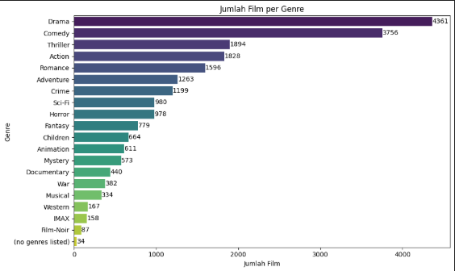
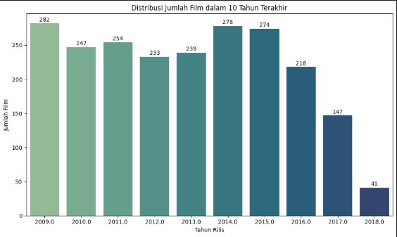
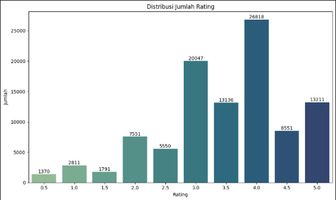
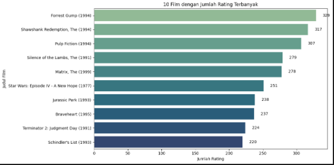
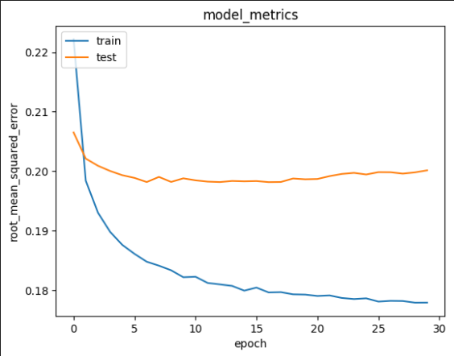

# Laporan Proyek Machine Learning - Faris Ghina Purohita

## Project Overview

Dalam era digital saat ini, layanan streaming film menjadi sangat populer. Dengan jumlah film yang terus meningkat, pengguna sering mengalami kesulitan dalam memilih film yang sesuai dengan preferensi mereka. Sistem rekomendasi hadir sebagai solusi untuk membantu pengguna menemukan film yang relevan dan menarik berdasarkan riwayat atau preferensi mereka sebelumnya.

Sistem ini merupakan perangkat lunak yang dirancang untuk memberikan saran atau rekomendasi item tertentu, dalam hal ini film, berdasarkan data preferensi, perilaku, atau riwayat interaksi pengguna sebelumnya [[1](https://link.springer.com/book/10.1007/978-0-387-85820-3)]. Dengan adanya sistem rekomendasi, pengguna dapat lebih mudah menemukan film-film yang mungkin belum mereka ketahui namun berpotensi sesuai dengan minat mereka, sehingga meningkatkan kepuasan dan pengalaman pengguna secara keseluruhan [[2](https://doi.org/10.1016/j.knosys.2013.03.012)].

**Referensi**
Referensi

[1] Ricci, F., Rokach, L., Shapira, B. (2015). Recommender Systems Handbook. Springer.

[2] Bobadilla, J., Ortega, F., Hernando, A., & Gutiérrez, A. (2013). Recommender systems survey. Knowledge-Based Systems, 46, 109-132.

**Mengapa Proyek Ini Penting Untuk Diselesaikan?**
- Meningkatkan Pengalaman Pengguna : Memudahkan pengguna dalam menemukan film yang sesuai minat mereka tanpa harus mencari secara manual.
- Meningkatkan Retensi dan Engagement : Rekomendasi yang baik membuat pengguna lebih lama menggunakan aplikasi dan lebih sering kembali.
- Membantu Promosi Film : Rekomendasi dapat memberi kesempatan pada produser film, sutradara, dan artis untuk dikenal.
- Memanfaatkan Data Secara Maksimal : Industri film memiliki data dalam jumlah besar yang dapat dimanfaatkan untuk dapat memberikan insight yang bermanfaat bagi produser film, artis, dan pengguna.

## Business Understanding

Pengembangan sistem rekomendasi film memiliki potensi besar untuk memberikan berbagai manfaat signifikan bagi para penikmat film, dan produser film. Sistem ini dirancang untuk menciptakan pengalaman yang lebih personal dan efisien dalam menemukan tontonan yang sesuai. 

### Problem Statements
Berdasarkan latar belakang di atas, berikut ini merupakan rincian masalah yang dapat diselesaikan pada proyek ini:
- Berdasarkan data mengenai pengguna, bagaimana membuat sistem rekomendasi yang dipersonalisasi dengan teknik content-based filtering?
- Dengan data rating dimiliki, bagaimana perusahaan dapat merekomendasikan film lain yang mungkin disukai dan belum pernah dikunjungi oleh pengguna? 

### Goals

Menjelaskan tujuan proyek yang menjawab pernyataan masalah:
- Menghasilkan sejumlah rekomendasi film yang dipersonalisasi untuk pengguna dengan teknik content-based filtering.
- Menghasilkan sejumlah rekomendasi film yang sesuai dengan preferensi pengguna dan belum pernah ditonton sebelumnya dengan teknik collaborative filtering.

### Solution Approach
Untuk mencapai tujuan tersebut, sistem rekomendasi ini akan menggunakan dua pendekatan utama:

- Content-Based Filtering Sistem ini menganalisis fitur atau konten dari item, seperti judul, genre, atau kata kunci, untuk menemukan dan merekomendasikan item lain yang memiliki kemiripan dengan preferensi pengguna.
- Collaborative filtering adalah teknik dalam sistem rekomendasi yang memprediksi item yang mungkin disukai oleh pengguna berdasarkan penilaian atau preferensi pengguna lain yang memiliki kesamaan dengan pengguna tersebut. Prinsip dasarnya adalah bahwa pengguna yang memiliki preferensi serupa di masa lalu cenderung memiliki preferensi yang sama di masa depan

## Data Understanding
Dataset yang digunakan dalam proyek ini berasal dari [Kaggle - Movie Lens Small Latest Dataset](https://www.kaggle.com/datasets/shubhammehta21/movie-lens-small-latest-dataset). Dataset ini berisi informasi terkait data movies seperti judul film dan genre, data links berisi informasi koneksi antara movieId di dataset ini dengan ID di basis data film eksternal (IMDB dan TMDB), data tags berisi tag atau anotasi yang diberikan pengguna pada film, dan data ratings berisi terkait rating dari pengguna terhadap film. Pada proyek kali ini akan menggunakan hanya dataset pada data movies, dan ratings. Pada kedua dataset tersebut tidak terdapat missing value, dan data duplikat, sehingga data sudah siap untuk digunakan lebih lanjut.

**Exploratory Data Analysis**

**Deskripsi Variabel**

**File `movies.csv`**
Berikut informasi fitur dari dataset menggunakan fungsi `movies.info()`. Berikut adalah hasilnya:
| #   | Column  | Non-Null Count | Dtype  | Deskripsi                                           |
|-----|---------|----------------|--------|-----------------------------------------------------|
| 0   | movieId | 9742 non-null  | int64  | ID unik dari masing-masing film                     |
| 1   | title   | 9742 non-null  | object | Judul film beserta tahun rilis                      |
| 2   | genres  | 9742 non-null  | object | Genre film         |

Melihat 5 informasi pertama dalam dataset dengan menggunakan fungsi `movies.head()`.
| movieId | title                            | genres                                      |
|---------|----------------------------------|---------------------------------------------|
| 1       | Toy Story (1995)                 | Adventure\|Animation\|Children\|Comedy\|Fantasy |
| 2       | Jumanji (1995)                   | Adventure\|Children\|Fantasy                |
| 3       | Grumpier Old Men (1995)          | Comedy\|Romance                             |
| 4       | Waiting to Exhale (1995)         | Comedy\|Drama\|Romance                      |
| 5       | Father of the Bride Part II (1995) | Comedy                                    |

Berikut visualisasi dari dataset movie.csv

**Insight dari dataset movies.csv**
Banyak data yang terdapat pada file `movies.csv` adalah `9742` dan terdapat `19` genre film, dengan `1` genre tidak diketahui (no genres listed). Genre paling banyak yaitu `Drama` dengan `4361` film, dan genre paling sedikit yaitu `Film-Noir` dengan jumlah `87` film, genre `no genre listed` tidak termasuk karena tidak diketahui nama genrenya.
Selama 10 tahun terakhir, persebaran jumlah film terbanyak pada tahun `2009` dengan `282` film, dan paling sedikit pada tahun `2018` dengan `41`

**File `ratings.csv`**
Berikut informasi fitur dari dataset menggunakan fungsi `ratings.info()`. Berikut adalah hasilnya:
| #   | Column  | Non-Null Count | Dtype  | Deskripsi                                           |
|-----|---------|----------------|--------|-----------------------------------------------------|
| 0   | userId | 100836 non-null  | int64  | 	ID unik untuk setiap pengguna yang memberikan rating                     |
| 1   | movieId   | 100836 non-null  | int64 | 	ID unik untuk setiap film                      |
| 2   | rating  | 100836 non-null  | float64 | Nilai rating yang diberikan oleh pengguna terhadap film         |
| 3   | timestamp | 100836 non-null  | int64  | Waktu saat rating diberikan

Melihat 5 informasi pertama dalam dataset dengan menggunakan fungsi `ratings.head()`.
| userId | movieId | rating | timestamp |
|--------|---------|--------|-----------|
| 1      | 1       | 4.0    | 964982703 |
| 1      | 3       | 4.0    | 964981247 |
| 1      | 6       | 4.0    | 964982224 |
| 1      | 47      | 5.0    | 964983815 |
| 1      | 50      | 5.0    | 964982931 |

Berikut visualisasi dari dataset ratings.csv

**Insight dari dataset ratings.csv**
Banyak user yang memberikan rating sebanyak `610`, dari jumlah film `9724`, dengan data rating sebanyak `100836`. 
Distribusi jumlah rating terbanyak yaitu pada rating `4,0` dengan jumlah `26818` rating, dan terkecil pada rating `0,5` dengan jumlah `1370` rating.

## Data Preparation
Tahap data preparation dilakukan agar data siap digunakan untuk proses modeling machine learning. Tanpa persiapan yang baik, model cenderung tidak akurat atau tidak stabil karena ketidakseimbangan data, atau skala data yang berbeda-beda.
Berikut adalah langkah-langkah yang dilakukan pada tahap data preparation:
### Content Based Filtering
**1. Mengubah Kolom Menjadi List**
Mengubah kolom tertentu menjadi list untuk mempermudah manipulasi dan pencocokan data, antara lain pada kolom `movieId` menjadi `movieid`, `title` menjadi `movie_title`, dan `genres` menjadi `movie_genre` pada dataset movies.

**2. Membuat Dictionary dari List**
Membuat dictionary dari list untuk menentukan pasangan key-value pada data `movieid`, `movie_title`, dan `movie_genre` yang telah disiapkan sebelumnya, dengan nama dictionary `movie_new`.

**3. Sampling Dataset**
Mengambil sebagian data dari dataset besar untuk mempercepat eksplorasi dan pemodelan awal, dengan fungsi `sample(5)` untuk melihat 5 data pertama dari dataset.

**4. TF-IDF Vectorization**
TF-IDF dilakukan untuk mengubah teks (movie_title atau judul film) menjadi representasi numerik berbobot menggunakan TF-IDF, untuk menangkap pentingnya kata dalam konteks.
Output matriks TF-IDF `(9742, 9269)` yang berarti ada 9742 baris dan 9269 kolom kata unik.

### Collaborative Filtering
**1. Encoding ID (Label Encoding)**
Mengubah ID user dan movieId menjadi angka untuk dapat diproses oleh model.

**2. Mapping Id**
Tahap ini untuk melakukan mapping atau mengganti nilai userID di DataFrame df menjadi nilai numerik (encoded).
Dengan fungsi `.map()`.

**3. Pengecekan dan Persiapan Data Akhir**
Pada tahap ini cek beberapa hal dalam data seperti jumlah user, jumlah judul film, dan mengubah nilai rating menjadi float. Untuk mengecek jumlah menggunakan fungsi `.len()`, selanjutnya untuk melihat minimal data menggunakan fungsi `.min()`, dan maximal data menggunakan fungsi `.max()` dan untuk mengubah nilai rating menjadi float menggunakan fungsi `.astype(np.float32)`.

**4. Data Splitting**
Pada tahap ini kita akan membagi data menjadi 2 bagian yaitu data latih dan validasi untuk evaluasi model yang objektif. Pada proyek ini data dibagi menjadi `80%` untuk `data latih` dan `20%` untuk `data validasi`.

## Modeling 
### Content Based Filtering
Pada tahap modeling menggunakan Content-Based Filtering, rekomendasi yang diberikan berdasarkan kesamaan konten dari film, dalam hal ini judul film.

Tahap ini untuk mendapatkan rekomendasi film yang paling sesuai dengan film yang telah ditonton, menggunakan 
fungsi `recommendations(title, similarity_data=cosine_sim_df, items=data[['movie_genre', 'movie_title']], k=10)` dengan penjelasan parameter sebagai berikut:
- title : Judul film (index kemiripan dataframe).
- Similarity_data : Dataframe mengenai similarity yang telah  didefinisikan pada tahap cosine similarity yang digunakan untuk menghitung derajat kesamaan (similarity degree) antar film, dengan  output matriks cosine similarity sebagai berikut :
array([[1.        , 0.18731077, 0.13388121, ..., 0.        , 0.        ,
        0.        ],
       [0.18731077, 1.        , 0.14702473, ..., 0.        , 0.        ,
        0.        ],
       [0.13388121, 0.14702473, 1.        , ..., 0.        , 0.        ,
        0.        ],
       ...,
       [0.        , 0.        , 0.        , ..., 1.        , 0.        ,
        0.        ],
       [0.        , 0.        , 0.        , ..., 0.        , 1.        ,
        0.        ],
       [0.        , 0.        , 0.        , ..., 0.        , 0.        ,
        1.        ]])
- Items : Nama dan fitur yang digunakan untuk mendefinisikan kemiripan, dalam hal ini adalah `movie_genre` dan `movie_title`.
- k : Banyak rekomendasi yang ingin diberikan.

Percobaan dengan menggunakan fungsi `recommendations('Toy Story (1995)')` menghasilkan 10 buku teratas dengan judul mirip, dengan hasil sebagai berikut :

| movie_title                       | movie_genre                                         |
|----------------------------------|-----------------------------------------------------|
| Toy Story 2 (1999)               | Adventure\|Animation\|Children\|Comedy\|Fantasy     |
| Toy Story 3 (2010)               | Adventure\|Animation\|Children\|Comedy\|Fantasy\|IMAX |
| Toy, The (1982)                  | Comedy                                              |
| Toy Soldiers (1991)             | Action\|Drama                                       |
| L.A. Story (1991)               | Comedy\|Romance                                     |
| Pyromaniac's Love Story, A (1995)| Comedy\|Romance                                     |
| Kid's Story (2003)              | Animation\|Sci-Fi                                   |
| Christmas Story, A (1983)       | Children\|Comedy                                    |
| Love Story (1970)               | Drama\|Romance                                      |
| True Story (2015)               | Drama\|Mystery\|Thriller      

`Kelebihan Content Based Filtering`: 
- Personalisasi Tinggi: Sistem dapat memberikan rekomendasi yang sangat disesuaikan dengan preferensi pengguna berdasarkan fitur item yang mereka sukai sebelumnya.
- Tidak Memerlukan Data Pengguna Lain: Content-based filtering hanya membutuhkan data terkait item yang dianalisis, sehingga tidak bergantung pada interaksi atau data pengguna lain, membuatnya cocok untuk situasi dengan sedikit data pengguna.
- Rekomendasi yang Mudah Dipahami: Pengguna cenderung memahami mengapa mereka menerima rekomendasi, karena sistem merekomendasikan item berdasarkan kesamaan fitur yang mereka sukai.
- Adaptif: Sistem dapat dengan mudah beradaptasi dengan perubahan preferensi pengguna

`Kekurangan Content Based Filtering`: 
- Masalah Cold Start: Content-based filtering kesulitan memberikan rekomendasi yang baik untuk item baru yang belum memiliki cukup informasi atau deskripsi, serta untuk pengguna baru yang belum memiliki riwayat preferensi.
- Keterbatasan dalam Diversifikasi: Rekomendasi sering kali terlalu sempit karena hanya berdasarkan pada kesamaan fitur.
- Overfitting pada Preferensi Pengguna: Terkadang sistem cenderung merekomendasikan item yang hampir identik dengan yang sebelumnya disukai pengguna, mengabaikan variasi atau keinginan eksplorasi pengguna yang lebih luas.
- Memerlukan Pemahaman Fitur yang Mendalam: Untuk dapat memberikan rekomendasi yang akurat, sistem memerlukan informasi mendalam dan representasi yang baik dari fitur item.

### Collaborative Filtering 
Pada tahap modeling ini menggunakan RecommenderNet (Custom Keras Model) dengan: Embedding layer untuk user dan film. Dot product untuk memprediksi rating. Proses compile pada model dengan binary crossentropy sebagai loss function, adam sebagai optimizer, dan RMSE sebagai metrik dari model. Hasil pelatihan : `Epoch 30/30 - RMSE: 0.1774 (train), dan 0.2001 (val)`

Prediksi rating paling tinggi untuk film yang belum pernah dilihat oleh user, dengan hasil sebagai berikut :

==================================================================================
Showing recommendations for users: 36
===========================
Movie with high ratings from user
--------------------------------
L.A. Confidential (1997) : Crime|Film-Noir|Mystery|Thriller
Waking Ned Devine (a.k.a. Waking Ned) (1998) : Comedy
Never Cry Wolf (1983) : Adventure|Drama
American Graffiti (1973) : Comedy|Drama
Almost Famous (2000) : Drama
--------------------------------
Top 10 movie recommendation
--------------------------------
Antonia's Line (Antonia) (1995) : Comedy|Drama
Heidi Fleiss: Hollywood Madam (1995) : Documentary
Paths of Glory (1957) : Drama|War
Jules and Jim (Jules et Jim) (1961) : Drama|Romance
Guess Who's Coming to Dinner (1967) : Drama
Trial, The (Procès, Le) (1962) : Drama
Adam's Rib (1949) : Comedy|Romance
Tekkonkinkreet (Tekkon kinkurîto) (2006) : Action|Adventure|Animation|Crime|Fantasy
Band of Brothers (2001) : Action|Drama|War
Three Billboards Outside Ebbing, Missouri (2017) : Crime|Drama
=====================================================================================

`Kelebihan Collaborative Filtering` :
- Tidak memerlukan informasi item secara eksplisit, hanya membutuhkan data interaksi pengguna (seperti rating atau klik).
- Mampu menangkap preferensi pengguna yang kompleks, dapat menemukan hubungan tersembunyi antar item berdasarkan perilaku pengguna yang mirip.
- Personalisasi tinggi, rekomendasi disesuaikan langsung berdasarkan riwayat interaksi pengguna.
- Adaptif terhadap perubahan preferensi pengguna, model akan berubah seiring bertambahnya data interaksi baru.

`Kekurangan Collaborative Filtering`
- Sparsity (Kelangkaan data), jika hanya sedikit user yang memberikan rating, sistem bisa kesulitan menemukan pola.
- Scalability, dataset besar (ribuan user dan item) membutuhkan waktu komputasi tinggi jika tidak dioptimasi.
- Popularity Bias, cenderung merekomendasikan item populer dan mengabaikan item niche atau unik.
- Rentan terhadap manipulasi, user bisa memberikan rating palsu (shilling attacks) untuk memengaruhi rekomendasi.

## Evaluation
### Content Based Filtering                      |
**Metrik Evaluasi** yang digunakan adalah Precision@K dan Recall@K, dengan formula sebagai berikut
- Precision@K = `True Positif / Total Rekomended Items`, metrik ini bekerja misalkan sistem merekomendasikan 5 film (K=5) ke pengguna, dan dari kelima film tersebut, 3 film ternyata disukai oleh pengguna (relevan), maka `3/5 = 0,6`, Precision@K berfokus pada akurasi dari top-K rekomendasi. Semakin tinggi nilainya, semakin banyak rekomendasi yang tepat sasaran dari total yang diberikan.
- Recall@K = `True Positif / Total Relevant Items`, metrik ini bekerja misalkan seorang pengguna menyukai 10 film secara keseluruhan, dan dari 5 film yang direkomendasikan (K=5), ada 3 yang memang dia sukai, maka `3/10 = 0,3`, Recall@K berfokus pada kelengkapan: seberapa banyak dari semua item relevan yang berhasil direkomendasikan.
**Interpretasi**
- `Toy Story 2 (1999)` :
    - Precision@5: 63.75% :
        Dari 5 rekomendasi teratas yang diberikan sistem kepada pengguna, sekitar 63.75% di antaranya benar-benar relevan (disukai atau cocok untuk pengguna). Artinya, sistem cukup akurat dalam memilih rekomendasi yang tepat untuk pengguna terkait film ini.
    - Recall@5: 65.74% :
        Dari seluruh film yang seharusnya relevan untuk pengguna (misalnya berdasarkan preferensi atau riwayat mereka), sistem berhasil menemukan dan menyarankan 65.74% di antaranya dalam 5 rekomendasi teratas. Artinya, sistem cukup komprehensif dalam menemukan film yang relevan meskipun hanya memberikan 5 rekomendasi.
- `Toy Story 3 (2010)` :
    - Precision@5: 62.76% :
        Dari 5 film yang direkomendasikan terkait Toy Story 3 (2010), 62.76% di antaranya sesuai dengan selera atau preferensi pengguna. Nilai ini sedikit lebih rendah dibanding Toy Story 2, tapi masih cukup baik.
    - Recall@5: 67.86% :
        Sistem berhasil mencakup 67.86% dari semua film yang seharusnya direkomendasikan kepada pengguna terkait Toy Story 3. Ini menunjukkan sistem agak lebih baik dalam cakupan (recall) dibanding Toy Story 2, walaupun presisinya sedikit lebih rendah.

Dengan evaluasi tersebut, teknik Content Based Filtering sudah bisa memberikan rekomendasi film yang dipersonalisasi untuk pengguna.

### Collaborative Filtering

**Metrik Evaluasi** yang digunakan adalah RMSE, metrik RMSE mengukur seberapa jauh prediksi model dari nilai sebenarnya, dengan memberi penalti lebih besar pada kesalahan yang besar. Semakin kecil RMSE, semakin baik performa model.
**Interpretasi Grafik RMSE**
- RMSE pada data train dan test sama-sama turun secara signifikan, menunjukkan bahwa model belajar dengan baik dan memperbaiki kesalahan prediksinya.
- RMSE pada data train terus menurun stabil hingga akhir pelatihan (~0.175), yang berarti model semakin cocok terhadap data pelatihan.
- Nilai akhir RMSE berada pada 0.1774, mengindikasikan error prediksi yang relatif rendah.

Dengan hasil evaluasi tersebut, teknik Collaborative Filtering sudah bisa menyesuaikan preferensi pengguna dan memberikan rekomendasi film yang belum pernah ditonton dengan rating tertinggi.
